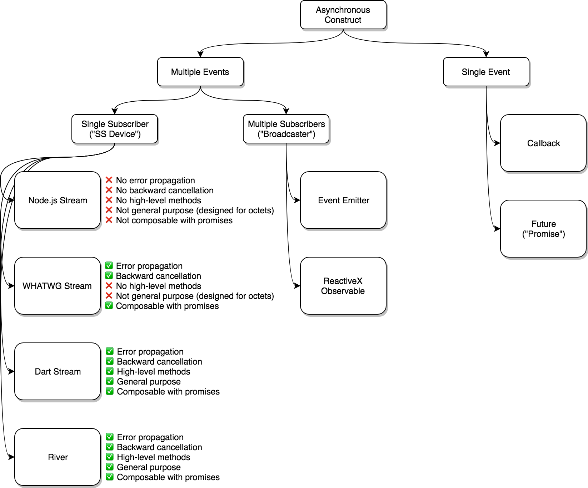
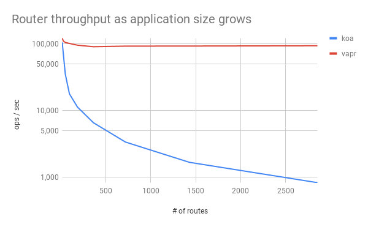

# koa-vapr-comparison

This is an opinionated study into the theory and practice of Koa and Vapr as competing HTTP frameworks.

## Background

Throughout the Node.js ecosystem, there exist many popular frameworks for building HTTP-based services. Some of these frameworks are very tailored towards specific use cases, and are not appropriate for the general case. Others, which are usually the most popular ones, are very general and may be applied to almost any HTTP-related task (aside from proxy servers, which are beyond the scope of this study). Notable examples include [Express](https://github.com/expressjs/express), [Restify](https://github.com/restify/node-restify), [Fastify](https://github.com/fastify/fastify), [Hapi](https://github.com/hapijs/hapi), and [Koa](https://github.com/koajs/koa). Adding to that list, [Vapr](https://github.com/JoshuaWise/vapr) is a new generic HTTP framework (created by the same author as this study). In particular, Koa and Vapr are of heightened interest. Both of these frameworks have similar capabilities, share similar design principles, and, by the opinions of this author, are the most advanced in terms of providing high-level functionality in exchange for minimal code use. Perhaps the most important quality though, is that both Koa and Vapr are the least opinionated of these frameworks (in the context of an HTTP framework, being "opinionated" is defined by providing features related to specific application use cases, rather than just matters relevant to the HTTP procotol). Although a more complete study would include all of the aforementioned frameworks, for the reasons just stated we will only focus on comparing Koa and Vapr.

The goal of this study is to convince readers that Vapr is the superior foundation for building generic HTTP services in Node.js. Despite this goal, we are careful not to ignore important spots where Koa may be superior. Some of such cases may be due to diverging priorities or intentional trade-offs. We will compare in terms of both theory and practice. There will be talk of design philosophy and "elegance", but also of relevant examples of performance and stability benchmarks. As a final note, we mention that Vapr is directly *inspired* by Koa, and its development would not have been possible without the foresight provided by the authors of Koa.

## Overview

This study is broken into four main sections.

1. [Power and Elegance](#1-power-and-elegance)
2. [Feature Completeness](#2-feature-completeness)
3. [Stability and Robustness](#3-stability-and-robustness)
4. [Performance](#4-performance)

The audience of this study is assumed to have had exposure to relevant programming concepts such as asynchronicity and higher-order functions, which are frequently utilized in Node.js. A familiarity with the [HTTP protocol](https://tools.ietf.org/html/rfc7230) is also assumed, and direct experience with popular HTTP frameworks such as [Express](https://github.com/expressjs/express) is preferred.

## 1. Power and Elegance

### 1.1. Defining the criteria

Programs are often described in terms of varying "power" and "elegance". The former refers to how easy it is to correctly perform complex tasks, where generally fewer lines of code equates to greater power. The latters refers to the intuitiveness of turning simple programs into more complex ones, where requiring fewer changes and fewer new concepts equates to greater elegance. The two properties are closely related, but independent of each other.

As an example, imagine a framework that provides very high-level tools, but they are limited in the ways they can be used. Perhaps a fully-featured inheritance system exists, but lots of configuration and boilerplate is required to create a minimal environment. Such a feature would be considered powerful but not elegant. An example of this is PHP's [Laravel](https://github.com/laravel/framework) framework.

In contrast, a program could be elegant but not very powerful. Imagine a framework that provides a composable plugin system, but does not provide any other high-level features for writing HTTP services. Such a system would be elegant but not powerful—many complex tasks would need to be writen by hand. An example of this is Node.js's [Connect](https://github.com/senchalabs/connect) framework.

Koa and Vapr attempt to be both powerful and elegant, and both are quite successful at it when compared to existing alternatives within the Node.js ecosystem. For the rest of this section, we'll dive deeply into some examples of how they compare and contrast within these criteria.

### 1.2. Plugin system

In contrast with most other HTTP frameworks, Koa and Vapr provide something much more powerful than a traditional *[connect-style](https://github.com/senchalabs/connect)* plugin system. The traditional system relies on passing control to so-called *next* functions which are provided as a parameter to each plugin. Each plugin typically performs its duty by mutating the *request* and/or *response* objects, followed by invoking *next* when it's finished. If a plugin wishes to respond to the request, it invokes a method similar to *[response.end](https://nodejs.org/api/http.html#http_response_end_data_encoding_callback)*, and simply does not invoke *next*. The problems with the *connect-style* system are equal to the problems of callback-passing in general (also called *continuation-passing*), which is a [well-studied topic](https://medium.com/@ejpbruel/the-drawbacks-of-callbacks-or-why-promises-are-great-5dedf2c98c67) and is universally regarded as bug-prone and inelegant. Fragile error handling, inversion of control, and the lack of composability are just a few of the many problems that make callback-passing unsuitable for dealing with asynchronicity in reasonably complex programs.

Recent versions of JavaScript are lucky enough to have [promises](https://javascript.info/promise-basics) and [async functions](https://javascript.info/async-await). Koa and Vapr plugins can be async functions, abandoning the use of callback-passing. The benefits of this are equal to the benefits of promises and async functions in general. The result is more expressive, less bug-prone code, and much greater elegance as the complexity of a program grows. Examples and evidence of this are easily searchable, so we choose not to dedicate any more time to the subject.

> To learn more, search the web for "callbacks vs promises".

Another major feature of both Koa and Vapr is the use of stack-like plugin execution. The major departure from the *connect-style* system is that when the main route logic is done, control will start flowing in the reverse direction, "unwinding" the plugins (like unwinding a stack). When the plugin stack has been completely unwound, a response is finally sent to the client. This allows plugins to easily perform operations after a response is ready, but before it's sent to the client. Use-cases include setting response headers, compressing a response stream, sanitization, round-trip logging, measuring latency, caching, and many more features that would be awkward or unreliable in a *connect-style* system. For the sake of futher discussion, any logic performed while unwinding the plugin stack will be called *late logic*.

Despite their similarities, Koa and Vapr each have important differences in their plugin systems. Koa implements *late logic* through the use of async functions, while Vapr utilizes [higher-order plugins](https://en.wikipedia.org/wiki/Higher-order_function) that return *[late handlers](https://github.com/JoshuaWise/vapr#functional-middleware)*. Both implementations result in similar levels of elegance, but we argue that higher-order plugins are the more powerful solution.

```js
// Late logic in Koa (async functions)
route.use(async (ctx, next) => {
  await next();
  ctx.response.set('X-Some-Header', 'foo');
});

// Late logic in Vapr (higher-order plugins)
route.use(req => res => {
  res.headers.set('X-Some-Header', 'foo');
});
```

To show the power of higher-order plugins, we must first reveal the problem with using async functions for late logic. The problem lies in the handling of expected and unexpected errors.

When an exception occurs in Koa, the *next* function will return a rejected promise with whatever value was thrown (typically an [Error](https://developer.mozilla.org/en-US/docs/Web/JavaScript/Reference/Global_Objects/Error) object). This makes it very easy to catch the error (via a *try-catch* statement or the [catch](https://developer.mozilla.org/en-US/docs/Web/JavaScript/Reference/Global_Objects/Promise/catch) method) and handle it appropriately (typically by logging the error and setting the response status to *500*). In fact, doing such a thing is so common that if you don't do it manually, Koa will do it for you automatically.

While this looks great in trivial examples, it falls apart in complex programs. Imagine that you set some response header in anticipation of a successful response, only to experience an unexpected error afterwards. Should that header be included in error responses too? If not, you'll have to manually remove it in your error handler (we'll call this *rollback logic*). In fact, your error handler must be aware of every possible thing that your application could do to the response object, *and* it must be aware of whether or not each of those mutations are valid for all responses or only for successful responses. In the extreme case, your error handler must be a decomposition of your entire application. This becomes very fragile (and unwieldy) in sufficiently complex programs.

The problem of rollback logic is just as apparent in the case of *expected errors*. It's common for programs to have conditional statements guarding against invalid requests or anticipated points of error. For example, if an invalid query parameter is provided, an appropriate reaction would be to send a *400 Bad Request* response. In Koa, to send an early response, a plugin simply does not invoke the *next* function (just as in a traditional callback-passing system). In this case though, no exception is thrown, so the error handler will have to implement the rollback logic for both exceptional and unexceptional cases. It should also be mentioned that most plugins which execute late logic (after the expected error is generated) will need to check the status code before continuing to operate; this in particular is a required pattern in Vapr as well, but we note that Koa does not escape this requirement.

By now, the clever reader might have deduced that the issue is not with async functions themselves, but with a shared, irreplaceable response object. When a condition occurs that changes the status of a response (e.g., from a success to a failure), the existing response object, which was meticulously crafted for a successful response, is no longer valid. All previous work should be discarded, and an entirely new response object should be used in its place to represent the error. This is exactly what some frameworks currently do, such as [Restify](https://github.com/restify/node-restify). Unfortunately, Restify lacks the concept of *late logic*, and is therefore unable to customize the error response further. The issue of maintaning a valid state for the response object at all times is analogous to the usage of mutable global variables.

Through the use of higher-order plugins, Vapr solves the problem elegantly and powerfully. Each *late handler* receives its own response object as a parameter. In the case of an anticipated error, a plugin can return a new response which replaces the existing one for subsequent late handlers—no rollback logic is necessary. For unexpected errors, a response object is automatically generated with a 500 status code, exposing the original Error object as a read-only property of itself. Unlike in Koa, no late logic is skipped due to exceptions being thrown. If a plugin is only interested in successful responses (or if it is only interested in error responses), it can simply check the status code before operating (which is a requirement in Koa too, as previously noted).

> As an advancement from Express, Koa enables the use of late logic, granting significant power to host applications—but with the consequence of requiring rollback logic. Vapr enables late logic without the consequence of rollback logic.

Most response headers are tied to other aspects of the response—examples include Content-Type, Content-Encoding, Location, Trailer, etc. However, in some cases a response header should be set regardless of outcome, such as the Server header. In the latter case, the header can simply be applied within the error handler or afterwards. In summary, if the header is related to data within the response, it's correct to discard the header when the status of the response changes; if the header is *unrelated* to the response, it can be applied regardless of whether the original response object was previously replaced or not. This is exactly what the Vapr plugin system allows you to do—with no extra effort on the programmer—regardless of program complexity.

### 1.3 Program Structure

Koa and Vapr take two different approaches when it comes to program structure. A Koa application is structured as a *tree* of plugins. One plugin might perform a mutation to the response object, while another plugin might route the request into a nested *sub-tree* of plugins to be processed further ([Connect](https://github.com/senchalabs/connect) and [Express](https://github.com/expressjs/express) behave this way too). In contrast, a Vapr application is composed of a top-level router that has a flat list of routes, where each route has its own, complete, encapsulated list of plugins.

The hallmark of Koa's system is its ability to have nested, cascading trees of plugins, facilitating the creation of *groups* of routes which all share some common plugins. Let's use the example of two routes, `/articles/:id` and `/articles/:id/render`. It may seem intuitive (and indeed likely) that any sub-route of `/articles/:id` will need to retrieve the selected article from some database. Rather than including that logic in every sub-route, it's standard to include it as a plugin inside the `/articles/:id` sub-tree. This way, when the route handler for `/articles/:id/render` is invoked, the relevant article will have already been retrieved.

```js
const router = new Router();
const subrouter = new Router();

router.get('/articles/:id', subrouter);

subrouter.use(retrieveArticle);
subrouter.get('/', rawArticle);
subrouter.get('/render', renderedArticle);
```

At first glance, the structure of Koa may seem quite elegant; the Vapr structure looks a bit rigid. But further investigation reveals that Vapr's flattened structure is nearly identical in power, but far more scalable. Koa's nested structure suffers from the same problems as any inheritance system. In recent years, programming languages have [shifted away](https://en.wikipedia.org/wiki/Composition_over_inheritance) from systems based on inheritance towards systems based on composition. The realization is that inheritance trees are frequently imperfect, and this realization is never more true than in the case of route construction.

Going deeper into the previous example, let's imagine that a new route is created called `/articles/:id/delete`. Deleting the article does not require retrieving it, but it's being retrieved anyways. The obvious solution is to split the `/articles/:id` sub-tree into two; one where the article is retrieved, one where it isn't. However, if this plugin sharing goes unnoticed (which it often does in large programs), incorrect and often arbitrary logic will leak into unsuspecting places. It's obvious to see that as program complexity grows, this inheritance system is not sustainable. Therefore, Vapr chooses the principle of composition instead of inheritance.

In Vapr, routes are *encapsulated* from other routes. No route inherits from another, and any shared plugins are declared explicitly. The result is that each route has its own complete set of plugins, and changing one route will never affect another route. To avoid verbosity and to enable easy composition, the *use* method in Vapr can accept any number of functions or arrays of functions (and any depth of nested arrays). The plugin lists are flattened at startup time, to avoid unnecessary overhead.

```js
const commonPlugins = [plugin1(), plugin2()];
route.use(commonPlugins, plugin3());
route.use(plugin4());
```

As seen above, you can still have the power of reusable logic, but everything is explicitly declared, rather than having a waterfall of plugins being applied implicitly based on the route's position relative to other routes.

### 1.4. Routing

Technically speaking, Koa does not have a built-in router. However, many consider [koa-router](https://github.com/alexmingoia/koa-router) to be Koa's defacto router (although written by a different author). Therefore, for the remainder of the study we'll consider koa-router to be Koa's router.

It's worth discussing the implications of implementing Koa's router as a separate plugin, rather than as part of the framework. For one, it allows plugins to be inserted before any routing takes place. This grants extra flexibility, but is in direct opposition with Vapr's concept of *route encapsulation* ([section 1.3](#13-program-structure)); a trade-off was made. Furthermore, if for some reason there were logic that truly needed to be executed before routing, it could be implemented by wrapping the Vapr app within another function (because a Vapr app is really just a configurable function), although this is not recommended. Such is normal practice elsewhere within JavaScript applications.

A common theme exists between how Koa handles plugins and how it handles routes: both are dictated by *declaration order*. As routes are declared, their defining pathnames (e.g., `/articles/:id`) are converted into [regular expressions](https://en.wikipedia.org/wiki/Regular_expression), and each route is concatenated into a list. When a request is made, the list is scanned linearly until an expression is matched, at which point the request is routed into the associated nested plugin tree ([section 1.3](#13-program-structure)).

In complex programs it's not abnormal to have multiple routes which could be matched from the same request URI. In this case, the "winning" route is simply whichever one was defined first. One could imagine performing the innocent action of changing the import order of modules (perhaps due to new [linting rules](https://eslint.org/docs/rules/sort-imports#import-sorting-sort-imports)), only to find that the behavior of the HTTP service has changed as a result. This behavior is practically never desirable.

An alternative, more simple solutions exists. In Vapr, routing is performed via a single hash lookup. Parameterized routes (e.g., `/:id`) are implemented by [radix tree](https://en.wikipedia.org/wiki/Radix_tree) lookup. Besides the  performance benefits of this approach ([section 4.2](#42-scaling-a-router)), it also creates an environment where routes are matched deterministically, independent of declaration order. While technically this is a *decrease* in power, we believe it's a power that most programmers don't want to deal with. The result is an increase in elegance for complex programs.

### 1.5. Asynchronous interface

Node.js is a heavily asynchronous, event loop-driven environment. Asynchronous programming is especially relevant within the context of an HTTP service, since many connections must be managed concurrently. In [section 1.2](#12-plugin-system) we did a cursory overview of common asynchronous strategies. In particular, we made a distinction between low-level *callbacks* and high-level *promises*. However, different strategies exist for solving different problems. Promises and callbacks are typically designed to solve the problem of representing a *single* future event. On the other hand, Node.js also has *[event emitters](https://nodejs.org/api/events.html)* and *[streams](https://nodejs.org/api/stream.html)* which are both designed to solve the problem of representing *multiple* future events. An analogy in synchronous programming is the distinction between a *single value* and an *iterator* or *array*.

There is also a distinction between the nature of [event emitters](https://nodejs.org/api/events.html) and [streams](https://nodejs.org/api/stream.html). The former is called a *broadcaster*, in that it does not care who is subscribed to it, it simply broadcasts events as they occur. When using a broadcaster, there's no way of guaranteeing that the events received are a complete representation of the system, or just a partial representation (typically because the subscriber started listening for events after some were already emitted). Within the context of an HTTP framework for example, this can happen if two different plugins try to read the request body, but the second plugin is executed at a later point in time than the first.

There are some situations where using a broadcaster is appropriate, but the case of representing an HTTP request body is not one of those situations. The request body is practically meaningless (and probably invalid from a syntactic point of view) if it's not reliably received in its entirety. To solve this difficult problem, organizations such as [WHATWG](https://streams.spec.whatwg.org/) and [Dart](https://www.dartlang.org/tutorials/language/streams#single-subscription-streams) have developed higher-level paradigms that achieve reliability by only allowing a single subscriber, buffering events until the subscription is created (we'll call these *SS devices*, meaning single-subscriber). Since Node.js's [streams](https://nodejs.org/api/stream.html) are meant to be used this way (despite actually allowing multiple subscribers), we'll also call them SS devices.

In contrast with broadcasters, which emit arbitrary event types, SS devices typically only emit a few specific event types—*data*, *end*, and *error*. Another point of contrast is that SS devices are able to buffer their own events, allowing the programmer to be more flexible about when the data is consumed. This already grants a significant increase in power when compared to the broadcaster—but we can go further.

All previously mentioned SS devices—except Node.js streams—implement error propagation. Error propagation is the property that if one device in a chain encounters an error, the entire chain will be destroyed, preventing a memory leak. Promises have a similar behavior (despite not needing to manage resource handles, being single events), which is one of the primary reasons they're desired over callbacks. Node.js streams can be piped together, but they do not exhibit error propagation.

Another feature exhibited by the SS devices—again, except Node.js streams—is backward cancellation. This is the property that if a subscriber is no longer interested in the event stream, it can destroy upstream (source) devices, preventing unnecessary resource usage.

As we dive deeper, we draw yet another distinction among paradigms—this time within the family of SS devices. One group contains [WHATWG streams](https://streams.spec.whatwg.org/) and [Node.js streams](https://nodejs.org/api/stream.html), while the other contains [Dart streams](https://www.dartlang.org/tutorials/language/streams#single-subscription-streams). The former group is mostly concerned with representing streams of octets, and is not so concerned with the general case (despite supporting "object streaming" in a rudimentary sense). The latter group is very concerned with the general case of streaming any type of event, and is equally capable of representing streams of octets. Dart streams do not sacrifice any elegance or power in exchange for general purpose use. Any desirable behavior utilized by the former group (such as counting bytes, rather than objects) can be reimplemented in a system that supports the general case.

Being general purpose, Dart streams implement many high-level methods for transforming event streams in various ways. For example, there are methods analogous to familiar [array methods](https://developer.mozilla.org/en-US/docs/Web/JavaScript/Reference/Global_Objects/Array) such as *map*, *filter*, *reduce*, and *find*, but also methods that only become relevant in the asynchronous context such as *timeout*. The (less elegant) Node.js streams and WHATWG streams require many complex lines of code to accomplish the same simple tasks.

```js
// Parsing a JSON request body (with Node.js streams)
function parse(body) {
  return new Promise((resolve, reject) => {
    const chunks = [];
    body.on('data', (chunk) => {
      chunks.push(chunk);
    });
    body.on('end', () => {
      try {
        resolve(JSON.parse(Buffer.concat(chunks)));
      } catch (err) {
        reject(err);
      }
    });
    body.on('error', reject);
    body.on('aborted', () => {
      reject(new Error('The request was aborted'));
    });
  });
}
```

```dart
// Parsing a JSON request body (with Dart streams)
dynamic parse(Stream<Uint8List> body) async {
  return body
    .map((chunk) => chunk.toList())
    .reduce(concat)
    .then((list) => JSON.decode(UTF8.decode(list)))
}
```

Perhaps the biggest problem with Node.js streams is that they aren't composable with promises. None of the methods or interfaces associated with Node.js streams interact with promises in any way. In fact, programmers are forced to resort to callbacks, or to use the stream like a simple broadcaster. There's an obvious incompatibility when attempting to interweave the two constructs. The same problem does not exist when interweaving their synchronous counterparts; array methods accept single values, arrays can be treated as single values, etc.

Vapr embraces something very similar to a Dart stream. More specifically, it uses a brand of SS device called a *[river](https://github.com/JoshuaWise/wise-river)* (created by the same author as this study). Rivers are an indirect port of Dart streams into the JavaScript ecosystem, with a few design modifications. Rivers are a subclass of promises, meaning they share the same API, and can also be treated as single asynchronous events. As a matter of future-proofing, rivers are also [async iterables](https://github.com/tc39/proposal-async-iteration). Rivers propagate errors, exhibit backward cancellation, and are suitable for events of any type.

```js
// Parsing a JSON request body (with rivers)
function parse(body) {
  return body.all().then(Buffer.concat).then(JSON.parse);
}
```

Koa was written in a time when the usage of high-level asynchronous constructs was not common (at least within the Node.js community). Despite utilizing promises and async functions, Koa uses Node.js streams to represent request and response bodies, resulting in a reduction of both power and elegance.



## 2. Feature Completeness

### 2.1 Defining the criteria

When evaluating the usefulness of a software tool, "feature completeness" is usually a primary concern. This refers to which actions a user of the tool can or cannot perform, typically in a binary sense. Where the previous [section](#1-power-and-elegance) analyzed the *quality* of comparable features between the two frameworks, this section aims to point out any differences in the *existence* of such features.

In closed systems, feature completeness is easily agreed upon and well defined. However, in open systems such as Koa and Vapr, where elegant plugin systems exist, the concept becomes fuzzier and more opinionated. For example, Koa provides [features](https://github.com/koajs/koa/blob/master/docs/api/request.md#content-negotiation) that are generally optional in HTTP services. Someone who uses those features would likely see their inclusion as an example of feature completeness. On the other hand, Vapr only implements features that are truly a necessity, viewing anything else as subject to the opinions of the application author (such features are intentionally left out). In both frameworks, plugins are responsible for implementing opinionated logic, but Vapr is more strict about this principle, which may be seen as a positive or negative thing.

### 2.2 Request representation

In any HTTP framework, information about incomming requests must be readily available to the host application. Both Koa and Vapr provide all of such information, but their approaches on delivery differ. Both frameworks provide fields such as the [request target](https://tools.ietf.org/html/rfc7230#section-5.3) (also called the "URI"), [route parameters](https://github.com/JoshuaWise/vapr#routing), [headers](https://tools.ietf.org/html/rfc7230#section-3.2), [protocol version](https://tools.ietf.org/html/rfc7230#section-2.6), etc., but Koa takes the additional step of providing methods for interpreting various common headers. As an example, Koa provides [a method](https://github.com/koajs/koa/blob/master/docs/api/request.md#content-negotiation) for reasoning about the meaning of an [Accept](https://tools.ietf.org/html/rfc7231#section-5.3.2) header, should one exist in the request. Vapr provides no analogous method, relying on plugins to provide such functionality when needed. This is a common theme between the two frameworks but, for completeness, we attempt to list the specific features of Koa that Vapr omits (at least, as it is at the time of this writing).

- [`request.length`](https://github.com/koajs/koa/blob/master/docs/api/request.md#requestlength): the Content-Length header parsed as a number
- [`request.type`](https://github.com/koajs/koa/blob/master/docs/api/request.md#requesttype): the Content-Type header void of any parameters
- [`request.charset`](https://github.com/koajs/koa/blob/master/docs/api/request.md#requestcharset): the "charset" parameter within the Content-Type header
- [`request.query`](https://github.com/koajs/koa/blob/master/docs/api/request.md#requestquery): the parsed query string of the URI
- [`request.fresh`](https://github.com/koajs/koa/blob/master/docs/api/request.md#requestfresh): an interpretation of request cache freshness, combining logic of various conditional headers such as If-None-Match/ETag and If-Modified-Since/Last-Modified, which only works after certain response headers have been set
- [`request.subdomains`](https://github.com/koajs/koa/blob/master/docs/api/request.md#requestsubdomains): the hostname of the request, split into an array by the "." separating character, void of the last two domain labels
- [`request.idempotent`](https://github.com/koajs/koa/blob/master/docs/api/request.md#requestidempotent): an indicator of whether the request method is one of GET, HEAD, PUT, DELETE, OPTIONS, or TRACE
- [`request.is()`](https://github.com/koajs/koa/blob/master/docs/api/request.md#requestistypes): performs a boolean check for whether the Content-Type header matches one or more patterns
- [`request.accepts()`](https://github.com/koajs/koa/blob/master/docs/api/request.md#requestacceptstypes): performs a boolean check for whether the Accept header matches one or more patterns
- [`request.acceptsEncodings()`](https://github.com/koajs/koa/blob/master/docs/api/request.md#requestacceptsencodingsencodings): performs a boolean check for whether the Accept-Encoding header matches one or more patterns
- [`request.acceptsCharsets()`](https://github.com/koajs/koa/blob/master/docs/api/request.md#requestacceptscharsetscharsets): performs a boolean check for whether the "charset" parameter within the Content-Type header matches one or more patterns
- [`request.acceptsLanguages()`](https://github.com/koajs/koa/blob/master/docs/api/request.md#requestacceptslanguageslangs): performs a boolean check for whether the Accept-Language header matches one or more patterns

Some of these features can be implemented in less than a line of code. For example, `request.length` can be implemented in Vapr as `parseInt(headers.get('Content-Length'))`. Other features here are very opinionated or not flexible, which could cause many application developers to reach for a different (very similar) tool. An example of this is `request.query`, which uses a preconfigured query parser with no way of customization. Imagine you were building a [JSON API](http://jsonapi.org/) service that relies on JSON API's usage of nested query paramters (e.g., `fields[Article]`)—you would need to use a more flexible query parser, being sure to ignore the one built into your underlying framework.

While the lack of these features may seem like an inconvenience to some, Vapr's philosophy is to have no application-specific opinion built into the framework, while making it as easy as possible to impart such opinions when needed. No feature listed above cannot be implemented as a Vapr plugin and, in fact, nearly every feature listed above could potentially be implemented in a variety of ways, depending on the needs of the application.

### 2.3 Response representation

Back in [section 1.2](#12-plugin-system), we discussed major differences between how Koa and Vapr each deal with response objects. Aside from those differences, differences related to feature completeness also exist (and reflect the same differences in philosophy [just described](#22-request-representation)).

Both Koa and Vapr allow programmers to directly set the common properties of an HTTP response, such as [status code](https://tools.ietf.org/html/rfc7230#section-3.1.2), [reason phrase](https://tools.ietf.org/html/rfc7230#section-3.1.2) (also called the "status message"), and [header fields](https://tools.ietf.org/html/rfc7230#section-3.2). However, Koa does not provide an interface for setting [trailer fields](https://tools.ietf.org/html/rfc7230#section-4.1.2). For programs that require this functionality, programmers will need to bypass Koa and use core [http](https://nodejs.org/api/http.html) functions. Although trailers are a less commonly used feature of HTTP, the protocol considers them a core feature rather than an extension, so Vapr provides a high-level, promise-based interface for them.

As in the previous section, Koa implements additional tools for setting various common properties of HTTP responses.

- [`.length`](https://github.com/koajs/koa/blob/master/docs/api/response.md#responselength): sets the Content-Length header
- [`.type`](https://github.com/koajs/koa/blob/master/docs/api/response.md#responsetype-1): sets the Content-Type header, converting file extension inputs to a corresponding MIME type
- [`.lastModified`](https://github.com/koajs/koa/blob/master/docs/api/response.md#responselastmodified-1): sets the Last-Modified header, invoking [`.toUTCString()`](https://developer.mozilla.org/en-US/docs/Web/JavaScript/Reference/Global_Objects/Date/toUTCString) if a [Date](https://developer.mozilla.org/en-US/docs/Web/JavaScript/Reference/Global_Objects/Date) object is given
- [`.etag`](https://github.com/koajs/koa/blob/master/docs/api/response.md#responseetag): sets the ETag header, wrapping the string in quotes if it isn't already
- [`.is()`](https://github.com/koajs/koa/blob/master/docs/api/response.md#responseistypes): performs a boolean check for whether the Content-Type header currently matches one or more patterns
- [`.redirect()`](https://github.com/koajs/koa/blob/master/docs/api/response.md#responseredirecturl-alt): sets the status code to *304*, sets the Location header to a given string, and sets the body to some hard-coded HTML
- [`.attachment()`](https://github.com/koajs/koa/blob/master/docs/api/response.md#responseattachmentfilename): sets the Content-Type and Content-Disposition headers based on a file extension
- [`.vary()`](https://github.com/koajs/koa/blob/master/docs/api/response.md#responsevaryfield): invokes the [vary](https://www.npmjs.com/package/vary) [NPM](https://www.npmjs.com/) module, which appends a string to the Vary header

As in the previous section, many of these features can be implemented in less than one line of code, such as `.vary()`, `.length`, `.lastModified`, and `.etag`. Other features here are opinionated or inflexible, such as `.redirect()`, which outputs hard-coded HTML.

Many commonly used HTTP headers don't have an associated shorthand in Koa, so programmers may find themselves frequently checking the Koa documentation to see if one exists, or they might just ignore these shorthands entirely and set the header directly. Either way, Vapr has no opinion for such application-specific functionality.

It's worth noting that Koa also provides direct support for JSON response bodies, which are very frequently used in Node.js services. Since JSON is not part of HTTP, Vapr is happy to relegate it to a plugin. JSON responses can be implemented as a two-line plugin in Vapr.

```js
route.use(req => res => {
  res.body = JSON.stringify(res.body);
  res.headers.set('Content-Type', 'application/json; charset=utf-8');
});
```

### 2.4 Routing capabilities

The expected behavior of an HTTP router in Node.js is well established. In short, they're expected to route requests based on [URI pathnames](https://tools.ietf.org/html/rfc3986#section-3.3) and [HTTP methods](https://tools.ietf.org/html/rfc7231#section-4), support parameterized path segments (e.g., `/:id`), and report *404 Not Found* when a matching route does not exist. Both Koa and Vapr are capable of all of these behaviors, but Koa relies on its plugin system, where Vapr provides these features automatically. Koa and Vapr also support reporting *405 Method Not Allowed* when an unsupported HTTP method is requested on an existent pathname, although this is a less common feature throughout the Node.js ecosystem (many routers just emit *404* in these cases). Despite some similarities, the two routers are implemented differently, and therefore have different feature sets.

In Koa, *405* handlers must be explicitly inserted into the plugin tree anywhere a router or nested router exists. In contrast, Vapr provides *404* and *405* logic automatically, which is easy to do because of its flat plugin structure. Vapr allows programmers to override the default *404* or *405* handlers if desired (for example, to emit a help page for unrecognized requests). Additionally, while the Koa router only supports routing based on pathname, the Vapr router is able to route requests based on hostname as well, which can be useful for [virtual hosting](https://en.wikipedia.org/wiki/Virtual_hosting) or proxying requests. This is a non-issue for Koa, however, as its plugin system is able to accommodate this feature.

Routing in Koa is performed by linearly scanning a list of [regular expressions](https://en.wikipedia.org/wiki/Regular_expression) until a match is found. Because regular expressions are used internally, Koa allows programmers to create routes from regular expressions directly (they are not limited to string pathnames). Routing in Vapr is instead implemented using radix trees (for reasons described in sections [1.4](#14-routing) and [4.2](#42-scaling-a-router)), so routing based on regular expressions is not supported. Furthermore, one consequence of *route encapsulation* ([section 1.3](#13-program-structure)) is that such a feature cannot be implemented at the plugin level either. In other words, to use Vapr is to give up the ability to route requests based on regular expressions. For most programs, this is a non-issue; it is often seen as something to be avoided, as it can lead to unpredictable results. However, any program that depends on such functionality will be unable to use the Vapr framework without significant modification.

## 3. Stability and Robustness

### 3.1 Defining the criteria

Up until this point, the majority of the study has focused on theory and philosophy. We now intend to showcase the strength of Vapr as a concrete implementation. Discussions of elegance are misguided if the program in question cannot handle real-world stress. Real-world programs regularly have to deal with abnormal or invalid input from external systems, unsound program logic introduced by bad programming practices, and heavy work loads that can be burdensome on a system's limited capacity for throughput. The last of these will be covered later in [section 4](#4-performance).

A program is considered *robust* if it is capable of correctly identifying and handling abnormal or invalid input. For example, a program that accepts arbitrary string input but fails to correctly process [multibyte](https://en.wikipedia.org/wiki/UTF-8) characters would not be considered robust.

A program is considered *stable* if it is able to continue operating sensibly in the case of minor programmer error or poor programming practices. As an example, when writing a complex, heavily asynchronous program, it's difficult to maintain stability while using tools that can easily be used incorrectly (such as callback-passing instead of promises). When using lower-level tools, seemingly innocent changes can introduce program-breaking bugs. A stable system is one where it's very difficult to introduce major bugs, and where abnormal conditions are resolved in a sensible way.

### 3.2 Abnormal input

Abnormal conditions are commonplace in any network-based program. Connections can be destroyed unexpectedly, network packets of arbitrarily strange data can be received, and complex serialization formats can be parsed improperly. All of this remains true for the case of HTTP services in Node.js. For the most part, the core [http](https://nodejs.org/api/http.html) module handles much of the necessary processing of incomming network data. However, there are cases that need to be handled by userland libraries. The examples in this section are not cherry-picked to make Vapr appear artificially more robust, rather, they are a small sample of many sources of common issues.

In a variety of internet standards documents, such as the HTTP specification ([RFC 7230](https://tools.ietf.org/html/rfc7230)) and the URI specification ([RFC 3986](https://tools.ietf.org/html/rfc3986)), it's declared that URIs need to go through a variety of normalizations before being compared. For example, URIs can contain [percent-encoded](https://tools.ietf.org/html/rfc3986#section-2.1) sequences which, besides being case-insensitive, may be used to encode characters that have no special meaning in a given context. If URIs are compared as simple strings, two effectively equivalent URIs can be incorrectly interpreted as not equal. Since URIs can contain encoded Unicode code points, [Unicode normalization](https://en.wikipedia.org/wiki/Unicode_equivalence#Normalization) must also be performed before comparison. URI normalization is especially important for services that publish content in languages other than English, as the usage of Unicode is common for these services. Vapr performs correct URI normalization—Koa performs none.

> An executable example exists for the topic above: `npm run uri-normalization`

The HTTP specification ([RFC 7230](https://tools.ietf.org/html/rfc7230#section-3.2)) expresses that any whitespace which leads or trails a header value should not be interpreted as part of the value. Strangely, the core [http](https://nodejs.org/api/http.html) module correctly strips *leading* whitespace but not *trailing* whitespace. Without proper header framing, programs are vulnerable to bugs that are difficult to identify; a parser could throw an error for seemingly valid input; a regular expression could return a false negative. While Vapr fixes such behavior, Koa does not implement correct header framing.

> An executable example exists for the topic above: `npm run header-artifacts`

Unstable connections and dropped requests are commonplace in real-world HTTP services. An HTTP client may at any time, either intentionally or not, destroy the underlying connection, regardless of the server's state in handling the request. This can be a difficult problem to deal with, but Koa and Vapr both handle the situation gracefully. Neither framework exposes functions for explicitly sending data the client; both frameworks implicitly send the response when all plugins have finished operating. Not only does this lift an unnecessary burden from the programmer, but it also allows the underlying framework to be intellegent about how to handle the connection. If the connection was destroyed, the response can simply be discarded. Both frameworks operate on this principle.

> An executable example exists for the topic above: `npm run aborted-requests`

### 3.3 Invalid input

Aside from abnormal input, services must also be able to correctly recognize input that is entirely invalid and unacceptable. The HTTP specification ([RFC 7230](https://tools.ietf.org/html/rfc7230)) defines many criteria for differentiating between valid and invalid input and, for the most part, the core [http](https://nodejs.org/api/http.html) module follows the specification correctly. However, exceptions exists where it chooses to leave the responsibility to userland libraries.

In Node.js, the URI of a request (which is exposed as `request.url`), is left in its raw, serialized state, and no validation is performed on it automatically. Nearly all existing HTTP frameworks for Node.js use the built-in [url](https://nodejs.org/api/url.html) module for parsing `request.url`, including the Koa framework. There are multiple parsing functions within the built-in module, but all of them share some common characteristics. None of them care if the input string is correctly formed, and all of them attempt to correct or ignore any pieces of the URI which are invalid. This is quite helpful for general-purpose URL parsing, as it allows programs to be lenient about the input it accepts. However, in the case of HTTP request URIs, [RFC 7230](https://tools.ietf.org/html/rfc7230#section-3.1.1) explictly defines this as the incorrect behavior. The specification notes that accepting (and autocorrecting) an invalid request URI can lead to known security vulnerabilities. To combat this, Vapr obeys the specification by performing strict validation on request URIs, automatically discarding invalid requests.

> An executable example exists for the topic above: `npm run uri-validation`

Strict security-related requirements are also defined for the contents of the Host header, if provided. Most HTTP frameworks, including Koa, simply read the contents of the header blindly, exposing the value to application logic without respecting the validation mandated by [RFC 7230](https://tools.ietf.org/html/rfc7230#section-3.1.1). As in the previous case, Vapr performs the correct validation, refusing to service potentially malicious requests.

> An executable example exists for the topic above: `npm run host-validation`

### 3.4 Unsound program logic

Aside from unexpected input, another source of instability within a program comes from the program itself. Fragile program logic is frequently introduced by programmers because of short deadlines, hasty refactoring, or poor programming practices. If the backbone of a program (such as an HTTP framework) is also fragile, small errors which could potentially be handled gracefully instead compound into large, program-breaking errors. A stable system should make it very difficult to produce such errors. Vapr takes many steps to prevent some common sources of programmer error found within Node.js HTTP applications.

In dynamically typed languages, programmers regularly make assumptions about the types of the values they're using. Usually, explicit type-checks are inserted into critical places, and deduction is used (consciously or subconsciously) to infer the types of values as they travel through the flow of the program. This is common practice because it's intuitive and generally works well. However, if an incorrect assumption is made, bugs can easily be introduced. The typical way to break such an assumption is to change the type of a variable that gets used by multiple parts of a program. For example, a programmer may parse the value of an HTTP request header and then decide to store the parsed value into the same variable.

```js
app.get('/', (req) => {
  const parsedDate = new Date(req.headers.get('date'));
  req.headers.set('date', parsedDate);
});
```

Although this seems like an attractive pattern, it can break the assumptions that other parts of the program (such as third-party plugins) are making about the header variable, leading to bugs. The same can be said for nearly any property of any shared object. To avoid this class of bug altogether, Vapr's request objects are deeply immutable, and mutations to response objects are guarded by setters that perform type validations. Plugins in Vapr are able to trust the values they depend on, improving the confidence and stability of complex programs.

Another source of programmer error is simply the usage of difficult-to-use tools. Koa relies on Node.js streams for piping data, while Vapr utilizes [rivers](https://github.com/JoshuaWise/wise-river). As discussed in [section 1.5](#15-asynchronous-interface), Node.js streams do not exhibit error propagation or backward cancellation, and they do not enforce *single-subscriber* consumption. Each of these properties can be the cause of either memory leaks or logical program bugs. Similar to callback-passing, it's very easy to use Node.js streams incorrectly, which reduces the stability of any program utilizing them. In contrast, the high-level nature of rivers eliminate these sources of bugs. Using high-level tools typically improves code readibility as well, making it easier for programmers to express the necessary logic, further reducing the risk of human error.

### 3.5 Dependencies

One of the advantages of the Node.js platform is its large ecosystem of reusable software packages. Leveraging this ecosystem is a powerful way to reduce the development and research time required to solve standard problems. Although a person could spend weeks carefully reading standards documents to learn how to properly implement various aspects of the HTTP protocol, it's often just as effective to use a tool written by someone who has already done so. Despite this, a program with more third-party dependencies is a program with less control over its own longevity. Packages frequently become neglected and unmaintained for years at a time. This is especially true for smaller packages that are assumed to change infrequently due to their simplicity. The risk here is that when such a package actually does need to be updated, the original maintainer is no longer active, and it may become a laborious process to get it replaced. Koa depends on many small packages that each perform arguably trivial tasks. Vapr prefers to be responsible for its own code, with the exception of only three dependencies that are all written by the same author as Vapr itself. Despite having few dependencies, Vapr still remains as lean as Koa in regards to the size of its codebase.

## 4. Performance

### 4.1 Defining the criteria

Depending on the nature of a program, its developers may be concerned with the amount of throughput the program can handle at a given time. In Node.js, HTTP frameworks typically induce a negligible amount of overhead compared to the work of the application itself. However, there are some circumstances where unsuspecting HTTP frameworks may be the cause of meaningful amounts of overhead. In addition, if the work done by the application is extremely lightweight, framework overhead may become a question of concern. In this section, we'll address a few possible situations where an HTTP framework may cause substantial slowdowns in an application, followed by a discussion on micro-benchmarking.

### 4.2 Scaling a router

In nearly all HTTP frameworks for Node.js, routing is implemented by scanning a list of regular expressions until one is matched. This means routing is performed in linear time proportionate to the number of routes within the application. For small services that only have ten or twenty routes, this is effectively a non-issue. However, it's not abnormal for very large services to have more than one-hundred routes at a time, raising a legitimate concern.

Routing in Vapr is implemented using radix trees. Besides the benefits described in [section 1.4](#14-routing), this implementation does not suffer from efficiency issues when a large number of routes are required—routing is performed in constant time.



While only a minority of applications will be affected by router performance in Koa, it may become a difficult symptom to diagnose. In Vapr, the issue is eliminated altogether, ensuring that the underlying framework will not be a concern regardless of program size.

> Run the benchmark: `npm run scaling-a-router`

> When Vapr traverses its radix trees, there are some cases where it need to backtrack in order to find the correct route. Although substantial backtracking is rare, the benchmark above is intentionally tuned to cause the *maximum* amount of backtracking possible, simulating a pathological program where Vapr's algorithm performs in the worst possible way. Despite this, it still outperforms Koa in every test.

### 4.3 Resource management

TODO

### 4.4 Overall throughput

TODO

- Machine: MacBook Pro (Mid 2014, 2.8 GHz Intel Core i7, 16 GB 1600 MHz DDR3)
- Node: v10.6.0
- Method: [fastify/benchmarks](https://github.com/fastify/benchmarks) (all default settings)

|                  | Version       | Requests/s |
| ---------------- | ------------- | ----------:|
| http.Server      | 10.6.0        | 62026      |
| fastify          | 1.6.0         | 60816      |
| vapr             | 0.5.1         | 45290      |
| restify          | 7.2.1         | 38499      |
| koa + koa-router | 2.5.1 + 7.4.0 | 37259      |
| hapi             | 17.5.1        | 33930      |
| express          | 4.16.3        | 31189      |
